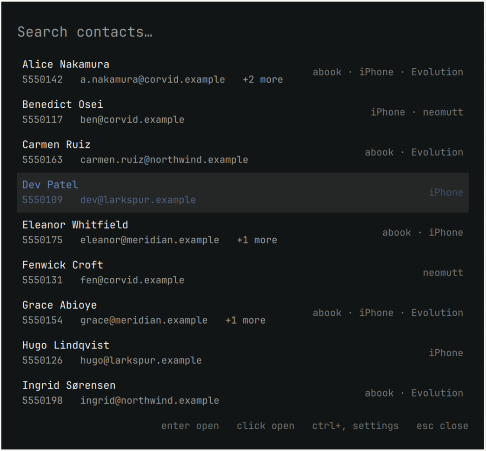
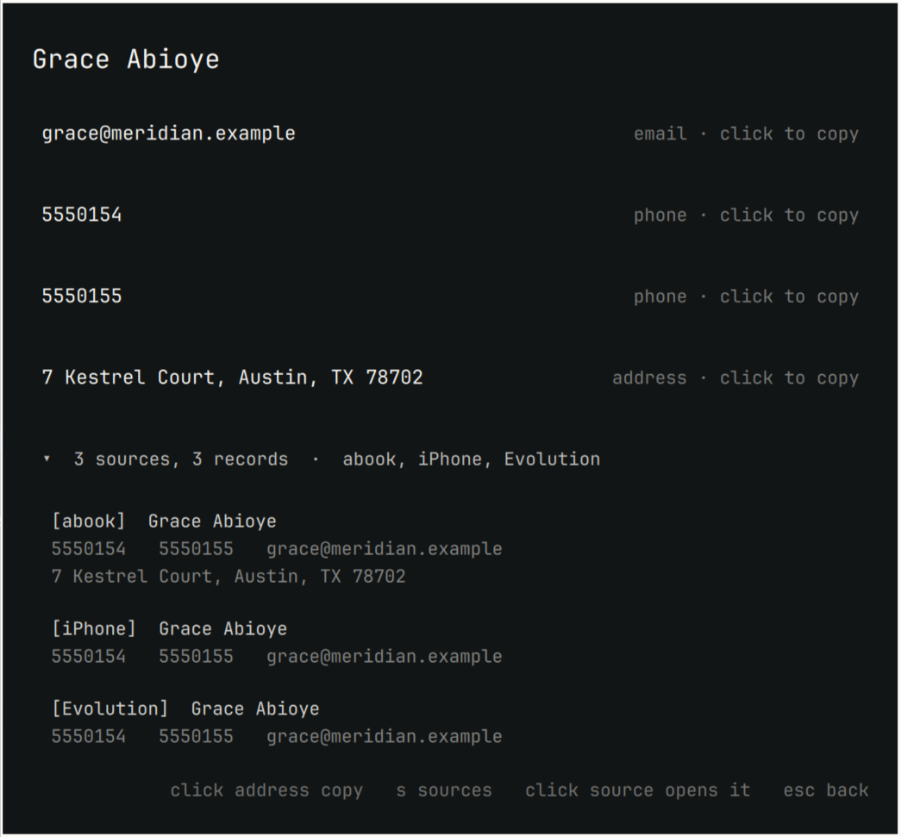

# OmaDex

One address layer for Omarchy. OmaDex reads the address books you already
have — your iPhone, abook, Evolution, neomutt aliases, indexed mail, CardDAV —
merges them into one set of people, and puts that behind a keyboard-driven
overlay.

OmaDex never writes to your address books. It does write one thing of its own:
the claim that two records are the same person. No source made that claim —
OmaDex did — so it keeps the evidence and shows its working. Expand any merged
contact to see the record each source contributed and what joined them.

The merged view is derived and rebuilt from the sources on every sync, so it
can be thrown away at any time. The exception is your corrections: telling
OmaDex that two people are the same, or that they are not, is the one thing it
keeps.



## What it does

- **Search everything at once.** `SUPER+CTRL+ALT+C`, type, Enter.
- **Show where a contact came from.** Expand a person to see the record each
  source contributed, then click one to open that application — neomutt
  composing to them, the exact vCard file, abook on the right address book.
- **Explain its merges.** A shared email address merges two records. A shared
  phone merges them only when the names also agree. Everything else is held
  for you to decide, and your decision survives every later sync.
- **Copy anything.** Click an address or a street address to put it on the
  clipboard.

Expanding a contact shows the record each source contributed, so OmaDex's
judgement can always be checked against the sources it came from — and
clicking one opens that application.



## Requirements

Omarchy, for the overlay and its launch helpers. The CLI works anywhere.

Every source is optional and OmaDex runs with any subset of them. Install
nothing and the overlay tells you what to set up.

| Source | Needs | Preloads a contact when opened |
|---|---|---|
| abook | `abook` | no — abook cannot open at a record |
| iPhone | `blueferry-backend` with `ListContacts` | no — no thread selector exists |
| Evolution | `evolution-data-server` | needs `gnome-contacts` |
| neomutt | `neomutt` | yes — composes to the address |
| Mail | `notmuch` with an indexed maildir | yes — searches mail with them |
| CardDAV | `vdirsyncer` writing a vdir | yes — opens the vCard |

### The iPhone source is optional and self-contained

OmaDex talks to an already-installed BlueFerry backend over D-Bus, using its
`ListContacts` method. It never fetches, builds, or installs that project:
follow [BlueFerry's own installation
instructions](https://github.com/erikwb/blueferry) if you want this source,
and skip it otherwise. Every other source works without it.

`omadex doctor` reports whether the running backend exposes the method. Without
that check the failure is silent: the phone stays paired, the daemon stays
healthy, and contacts simply never arrive. If it is missing, the iPhone source
stays unavailable and every other source carries on.

## Install

```bash
omarchy pkg aur add omadex
omadex plugin install     # copy the overlay into ~/.config/omarchy/plugins
omarchy plugin enable io.github.peteonrails.omadex
omadex sync
```

Or, from a checkout of this repository, `./build.sh -si` instead of the first line.

Or install the overlay straight from this repository:

```bash
omarchy plugin add https://github.com/peteonrails/omadex
omarchy plugin enable io.github.peteonrails.omadex
```

The plugin is only the interface. It needs the `omadex` package for anything
to appear, and says so if it is missing.

Bind the overlay by adding this to `~/.config/hypr/bindings.lua`:

```lua
o.bind("SUPER + CTRL + ALT + C", "Contacts",
       "omarchy-shell shell toggle io.github.peteonrails.omadex '{}'")
```

### Removing it

```bash
omarchy plugin disable io.github.peteonrails.omadex
omadex plugin remove          # deletes ~/.config/omarchy/plugins/io.github.peteonrails.omadex
omarchy pkg drop omadex       # if installed as a package
```

Your contacts are untouched — OmaDex only ever read them. To drop its own
derived data as well, delete `~/.local/state/omadex/` and
`~/.config/omadex/`, and remove the keybinding from
`~/.config/hypr/bindings.lua`.

### External dependencies

`python` and `wl-clipboard` are required; `xdg-utils` is used to open mail and
vCard files. Every contact source is optional — see the table above — and
OmaDex runs with any subset installed, including none. The Omarchy launch
helpers (`omarchy-launch-terminal`, `omarchy-launch-or-focus-tui`) are used to
open a source's own application. Nothing is bundled or vendored; there are no
Python dependencies outside the standard library.

## Command line

```bash
omadex doctor                     # is each source usable, and if not, why
omadex sync                       # rebuild from every enabled source
omadex search alice               # find people
omadex show <address> --records   # one person, and what each source gave
omadex list --source iPhone       # everyone a source contributed to
omadex open <address>             # open the application a record came from
omadex review                     # merges held back for a human
omadex link <a> <b>               # these two addresses are one person
omadex unlink <a> <b>             # these two are not
omadex sources                    # what is enabled, and where it reads from
omadex sources disable Mail       # turn a source off
```

## How merging works

Only addresses identify a person. Names never merge anyone — they are used to
*withhold* a merge, never to make one — and neither do street addresses, since
housemates share those.

- A **shared email** merges two records outright.
- A **shared phone** merges them only if their names agree, because colleagues
  share switchboards. Disagreeing names go to `omadex review`.
- A destination on four or more records under three or more names is a
  switchboard and merges nobody.
- Records with no address at all merge on an exact name match, which is safe
  precisely because they carry no address to attach to the wrong person.

Your `link` and `unlink` decisions live in the one table a sync never clears.

## Configuration

`~/.config/omadex/settings.json` holds only what you changed; everything else
follows the defaults, so upgrades reach you. `ctrl+,` in the overlay shows each
source, what it contributed, and where it reads from.

## Data

Contacts live in `~/.local/state/omadex/contacts.sqlite` (0600, in a 0700
directory), rebuilt from the sources on every sync. OmaDex sends nothing
anywhere and has no network code.

`omadexd` is packaged but not enabled. The overlay uses the CLI; the daemon
exists to serve `io.omadex.Contacts1` to other clients, and is opt-in:

```bash
systemctl --user enable --now omadex
```

## Licence

MIT.
